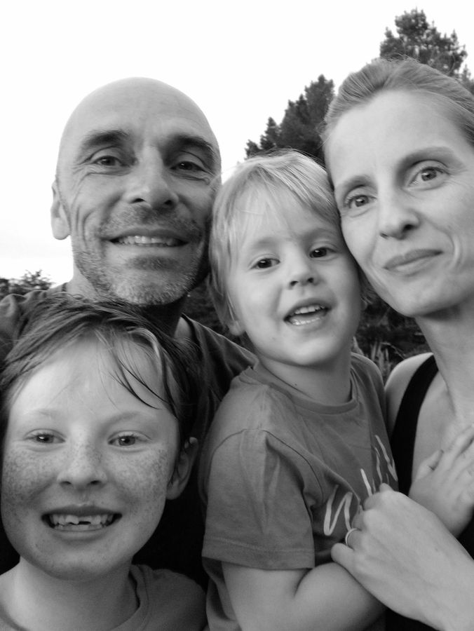



1967
: Born in London, UK

1990
: Graduated with B.Eng (Hons) in Electronic Communications Engineering from the Uni. of Hull

1990 - 1993
: Software engineer at APD-Mertech

1994
: PGCE in Secondary Education from the Uni. of Leeds

1994 - 2002
: Teacher of Design & Technology and ICT at Boston Spa School

2002
: Married my wife

2002 - 2007
: Head of ICT and Head of Secondary Section at The International School Seychelles

2007 - 2012
: Head of ICT at The English Academy, Kuwait

2011
: Daughter born

2013
: Emigrated to New Zealand

2013 - 2018
: Head of Digital Technologies at Tauranga Boys' College

2017
: Son born

2018 - Present
: Digital Learning Co-ordinator at Waimea College
{: .timeline}





Born in London, grew up in Kent. Educated as an Electronic Engineer, graduating with an honours degree from the University of Hull. Wrote code for a living for some years (mostly C, with some Delphi). Later retrained as a teacher of Design & Technology at the University of Leeds. 

Taught GCSE and A-Level D&T and ICT in Leeds for almost a decade. Married my awesome wife and, shortly after, moved to the tropical island of Mahé in [Seychelles](https://www.seychelles.com). Worked at [The International School](https://iss.sc/) for five years, initially as a teacher of IGCSE and A-Level ICT, and then as Head of Secondary Section. A wonderful place.

Moved to [Kuwait](https://simple.wikipedia.org/wiki/Kuwait) to top up our savings. Spent five years teaching at The English Academy. Our daughter was born in Kuwait.

Emigrated to [New Zealand](https://www.newzealand.com/int/). Employed as Head of Digital Technologies at [Tauranga Boys' College](https://www.tbc.school.nz) for five years. Our son was born in Tauranga. 

We moved to [Nelson](https://www.nelsontasman.nz) in the South Island where we now live and work, and where we intend to stay. It's a pretty great place to raise a family; always sunny, close to the sea and surrounded by forest, rivers, hills and mountains.

I work at [Waimea College](https://www.waimea.school.nz) and spend my time riding some of the [best mountain bike trails](https://www.pinkbike.com/news/destination-showcase-nelson-new-zealand-with-katy-winton-joe-nation-and-rae-morrison.html) in the world.





#### The Copley Family



 ------------------------------------------------------------------ 


